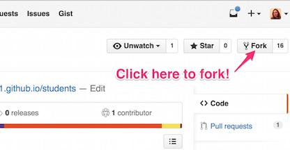
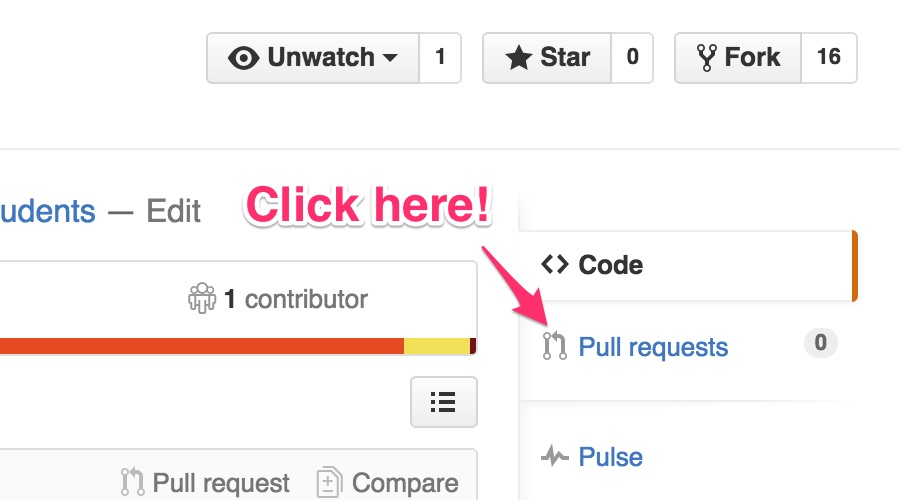

## Workflow

1. Most assignments will begin with a starter repository that you will *fork*.  This gives you a general layout for the project and any starter code that you should have to begin.  
2. You'll then *clone* the repository to your computer, this gets you the files to edit.
3. Make changes and *commit* them to your local repository.  It's a good habit to commit code locally (on your computer) often.  This allows you to make specific notes on what you've done in the commit messages, and gives you a point to go back to if you want to undo something.  
4. When you're done with a chunk of work, or just need to save it *in the cloud* to go home for the night, you *push* your changes up to GitHub.  
5. To get those changes on another computer, you *fetch* or *pull* them.  
6. When you are done with the assignment and are ready to submit it for grading, you make a *pull request*.  This allows me to give you in-code feedback as I  grade.  

Let's walk through this workflow on our student directory project.  

### Fork
First you'll get your own copy of the repository, this called "forking". A fork is your own personal copy of code.  You can modify it in any way you like, and it does not affect the person you copied it from.  However it does maintain a link, which we'll discuss later.

1. Go to our [GitHub CCIS1301 Org page](https://github.com/htc-ccis1301).  You'll notice there is a repository there called [students](https://github.com/htc-ccis1301/students).  
  

2. Click the link to go to the repository page, then click the icon in the upper right to *fork* the repository to your account.  
  

3. Now go to your GitHub page and you should see students under your repositories.  This is a copy of the repository from our class organization.  You can see the note that says it is forked.  That let's you know that it is a copy.
  

4. This is *your* copy.  The changes you make here are not made to the original repository in our organization.  

### Clone
Now you need to get the repository onto your computer so that you can work with it.  This is called "cloning".  

When you clone a repository for class, it is important that you do it from your fork of that repository. Look for your user id before the repository name and in the clone URL. If you clone the class repository you will not be able to push up your changes.

1. Click on the students link to go to the repository page.

2. Copy the URL from the repository page.  
  

3. Next we leave the browser and go to the command prompt.  On Windows, you'll want to use  GitShell which is part of GitHub for Windows.  On Mac, you can just use Terminal, but you may need to install git.  I will refer to this generically as the shell.  (See the install info at the bottom to set this up on your own computer.)

4. In the shell, go to the location where you want the repository to be pulled down.  Then use the <code>git clone</code> command to get a local copy. <code>$ git clone &lt;your-clone-url-here&gt;</code>

5. Now if you list your files/directories, you will see a students directory in that location.

6. When working with the repository, you need to be inside the git repository directory.  To go into a directory use the change directory command `cd`.  When you enter the command, you need to add the directory name after the cd.  So enter `cd students` to go into the students directory.

###  Make Changes
Now that you've got a copy, you can make changes to the original files.  You edit the files as you would any other code, using whatever editor you prefer.  (In the classroom, we have [Brackets](http://brackets.io/) installed for you.)  When you're ready to save a change, you'll make a commit.

1. Let's add your information to the directory.  Go into the students directory.  You should see an _data directory with a subdirectory for the current semester.  

2. Make a copy of my *mbmosman.yml* file and edit the name so that it is __*your GitHub*__ user name.

3. Open the file in an editor and update the contents to include information about you.  Here's a list of the [emoji](http://www.emoji-cheat-sheet.com/) you can use.  Be careful with the formatting.  It's key / value pairs, with the key followed by a colon (:) and then the value.  Each should be on its own line.  This is [YAML](http://www.yaml.org/start.html) data.

4. In most cases, you'd now test to make sure things look OK.  While you could test this locally, there's some extra set up needed for this type of Jekyll GitHub Pages site.  (Look it up later if you are curious.  This is how the course web site is built too.)  We'll skip the testing and just commit our change, but you might need to come back later and fix it if you weren't careful.

5. When you're done, it's back to the command line.  Use the <code>git status</code> command to see what changes you have made. <code>$ git status</code>

5. You should see that you've got an untracked file.  Use the <code>git add</code> command to add your file.  You can append the file name to the command to add a single file, or you can add a . to add all the new files at once. <code>$ git add &lt;your-file-name-here&gt;</code> OR  <code>$ git add .</code>

6. Use git status to verify that you're file has been added.  

7. Now it's time to commit the change.  This will version your change in your local git repository.  Use the <code>git commit</code> command. <code>$ git commit -m "Your message about the change here."</code>

8.  It's good to commit small groups of changes with specific messages.

### Push Changes
To get your changes from your local repository to the GitHub repository you do a push.

1. Before you push your changes, you should check that the branch you are on matches the remote branch you want to push to. It will often be master in the real world, but for many of our class assignments, which are web pages we want GitHub to host for us, it will be gh-pages.  You can see which branch you are working on by using the <code>git branch</code> command.

2. If your local and remote branches match, then you can just say <code>git push</code> and everything should go up to GitHub.

3. If your local and remote branches are different, then you need to say which remote branch you want to push to: <code>$ git push origin <remote-branch-here></code>

4.  Check the GitHub repository page in the browser to make sure you got the changes up successfully.  
  

### Test!
Before asking to merger your changes back into the class repository you should make sure you didn't break anything.  In GitHub, if you click on the Settings tab for your students repository, you should see that there is a URL where you page is published.

When you click the URL, you should see the Student Directory page with both my profile and yours.  

If the page is not coming up, double check the syntax and naming of your .yml file.  If you are not seeing your picture or icon, then your file name is not the same as your GitHub user id.  

### Pull Request
The changes are still on your copy of the students repository.  To get them back to the course organization repository you will create a pull request.  This is the last step - the part that turns in your assignment.

1. From your repository page, click the Pull Requests tab.  
  

2. Click the green button to create a new pull request.
  

3. The next screen will show you all the changes between your copy of the repository and the original.  Review the changes, then click the green button to create the request.

4. The next page allows you to enter a commit message and (optionally) comments for the reviewer.  
