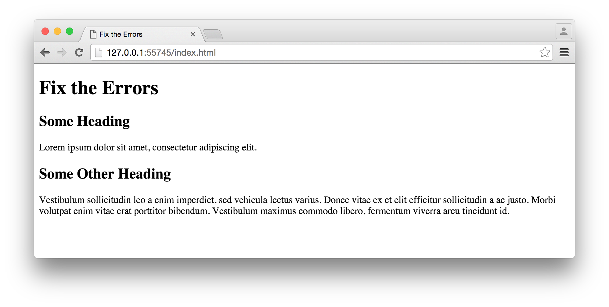

## Overview
This lab will have you resolve some validation errors on a basic web page.  Validation of your HTML pages is important to ensure correct coding and display of your web pages. You will lose a significant amount of points on your web pages if they are not valid, so it is important to understand how to validate the pages and correct any errors.

## GitHub
The GitHub repository for this assignment is [validation-lab](https://github.com/htc-ccis1301/validation-lab).

The repository contains an index.html file, but the HTML in that file is not valid and the page initially will not even display in the browser.

## Requirements
For this assignment, you must update the index.html file so that it contains valid HTML.  Run the file through the W3C validator at [http://validator.w3.org/](http://validator.w3.org/). The goal is to update the HTML so that it validates and displays correctly.

You may need to adjust and move HTML tags, but you should not remove any content.  When finished, the page should look like this in the browser:

## Submit the Assignment
Before submitting the assignment, you should double check that your page is valid using the [W3C HTML Validator](http://validator.w3.org/).  

After you have pushed your changes to your personal GitHub repository, make sure to validate that the page has published correctly.  You can find the URL under settings.  Be sure to copy this URL and paste it in the repository description.

When complete, the assignment must be submitted using a GitHub pull request with a screen shot of that pull request placed in the D2L dropbox.  
