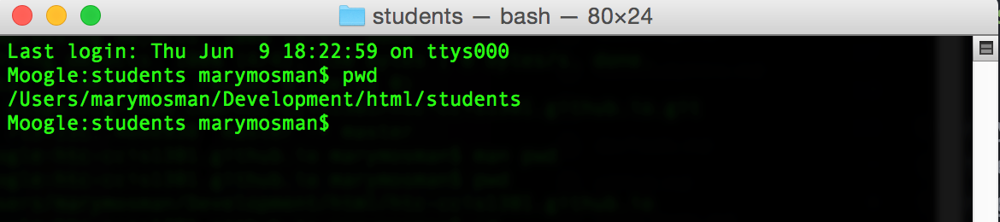
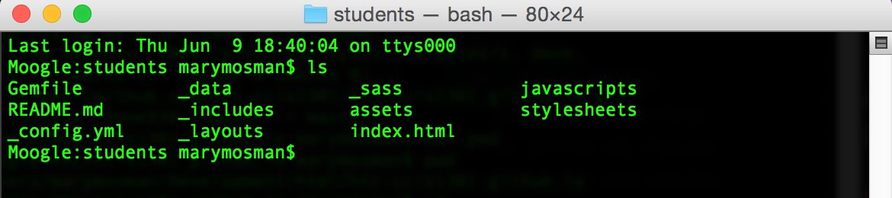
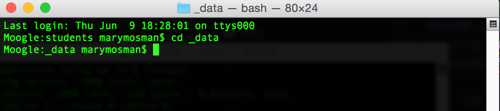
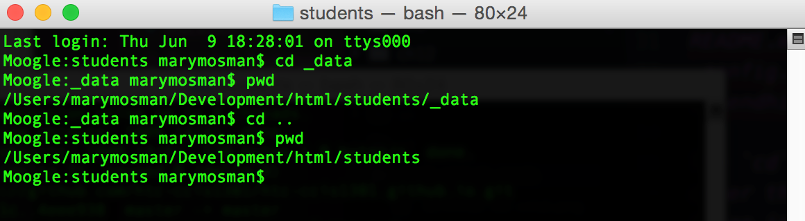

## Introduction
This is a quick introduction to shell (Windows Powershell, GitShell, and Mac Terminal) commands and basic GitHub commands that you'll use for each of the assignments.

## Shell Basics
First, when I include shell commands in the notes, they will begin with a $ (dollar sign). That indicates the start of the shell command line, and should not be typed in. Any lines that follow without the $ at the start, will show you sample output from that command if there is any. Not all commands will give you output when successful. So you would also not type in anything from a line that does not start with a $.

For example, the `pwd` command tells you your current working directory. Basically, this tells you where you are on your computer's file system.


$ pwd
/Users/marymosman/Development/html/students


When you try out this command, type only `pwd` into your shell window, do not type the $, then hit enter. It will output your current working directory on the next line, then give you a command prompt again.   

This is what it actually looks like on my computer.  I'm running on a Mac, so this is the Terminal.

There are really only two other commands that you need to know to get through this course - `ls` and `cd`.

The `ls`, or list, command will list all of the files and directories inside the current working directory.


$ ls
Gemfile        _data          _sass           javascripts
README.md      _includes      assets          stylesheets
_config.yml    _layouts       index.html


The `cd`, or change directory, command will change your working directory. When you enter the command, you type the directory to change to after the `cd`.  So if we want to go into the _data directory, we would enter:


$ cd _data


Notice there is no output this time.  

The cd command will not give output unless there is an error.  Make sure to watch for those.  

To go up a directory you enter `cd ..`


$ cd ..


Again there is no output, but you can use the `pwd` command to see that the working directory has changed:

## Git Commands
The GitHub Student Directory assignment walks you through the GitHub process that you'll use for your assignments.  But to summarize all of that, I'll introduce the key commands here.

### Clone
The `git clone` command will create a local copy of your repository from GitHub. The GitHub repository, what you see when looking at the website, lives on their servers "in the cloud".  That is a remote repository.  To work on your files, you need a local repository; one that is on your computer.


$ git clone <clone-url>


### Status
The `git status` command will give you the current status of your local repository. It will show you if you have changes that are untracked (not added), added and ready for commit, and how different your local repository is from the remote repository that you cloned from.

For example:

$ git status
On branch gh-pages
Your branch is up-to-date with 'origin/gh-pages'.
Changes not staged for commit:
  (use "git add <file>..." to update what will be committed)
  (use "git checkout -- <file>..." to discard changes in working directory)

	modified:   _data/summer_2016/mbmosman.yml

Untracked files:
  (use "git add <file>..." to include in what will be committed)

	_data/summer_2016/mbmosman2.yml

no changes added to commit (use "git add" and/or "git commit -a")


### Add
The `git add` command will stage, or mark, your local changes for commit. Changes that have been added are tracked, and changes that have not been added yet are untracked and will not be included in any commits that you make.

To add all changes, you can use this shortcut:

$ git add .


To add individual changes, you can use add plus the file name or directory to add:

$ git add <file-or-directory-name>


### Commit
The commit command will save and version your changes to your local repository. This saves the time of the commit, all of the changes to the staged (added) files, as well as the message that you enter.  These changes are then available to push to the remote repository.


$ git commit -m "added new file"
On branch gh-pages
Your branch is ahead of 'origin/gh-pages' by 1 commit.
  (use "git push" to publish your local commits)
 1 file changed, 3 insertions(+)
 create mode 100644 _data/summer_2016/mbmosman2.yml


Notice that the output will tell you which branch you are on (for this class that will usually be gh-pages), how many commits your local repository is ahead of the remote, and how many files were changed as part of this commit.

### Push
The `git push` command sends your local changes to the remote repository.  

If your local and remote branches match, you can just use the short form of the command:

$ git push
Counting objects: 5, done.
Delta compression using up to 8 threads.
Compressing objects: 100% (5/5), done.
Writing objects: 100% (5/5), 502 bytes | 0 bytes/s, done.
Total 5 (delta 3), reused 0 (delta 0)
To https://github.com/mbMosman/students.git
   182b32c..2823398  gh-pages -> gh-pages


Notice the output include a status to show it is 100% done and where it pushed the changes to.

If your local and remote branches are different, you can choose which remote branch to push to:

$ git push origin <remote-branch-name>

